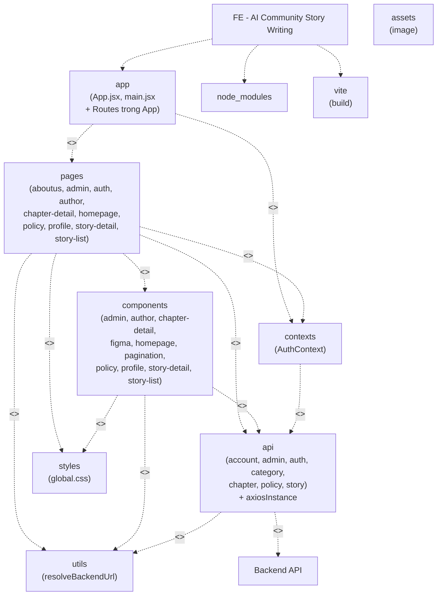

# Package Diagram – Frontend (FE)

Sơ đồ gói (package) của ứng dụng React/Vite, thư mục gốc `src/`.

## Sơ đồ theo mẫu UML (PMS-style) – Chuẩn và chính xác với FE dự án

Sơ đồ dưới đây **chỉ gồm những gì thực sự có** trong FE: đúng tên folder trong `src/`, không thêm package ảo (không có folder `routes`, không có `redux`, không có package `hooks`/`modal`/`types` tách riêng).

**Quan hệ (giống mẫu PMS):**
- **«use»** – package A sử dụng chức năng của package B.
- **«import»** – package A import module/component từ package B (ví dụ App.jsx import từng page để gắn vào Route).
- **«dependency»** – phụ thuộc bên ngoài (api gọi Backend).

**Gói gốc (root):** Tên dự án FE, chứa về mặt logic: *app* (entry + route), *node_modules*, *vite* (build). Trong code chỉ có `App.jsx`, `main.jsx` tương ứng *app*; không có folder routes — route nằm hết trong App.jsx.


### Mô tả Package Diagram (theo hình vẽ và đúng cấu trúc FE dự án)

Bảng dưới mô tả **chi tiết** từng package có trong sơ đồ (và trong thư mục `src/`), theo format: **No**, **Package**, **Description**.

| No | Package | Description |
|----|---------|-------------|
| 01 | **node_modules** | Chứa toàn bộ thư viện và dependency bên thứ ba do npm/yarn cài đặt. Ví dụ: **react**, **react-dom**, **react-router-dom** (điều hướng, Routes), **axios** (HTTP client), **lucide-react** (icon), **vite** và các plugin (build, HMR), **tailwindcss**, **autoprefixer**, **postcss**. Toàn bộ mã nguồn ứng dụng phụ thuộc vào các package này khi chạy và build. |
| 02 | **app** | Thư mục mã nguồn gốc của ứng dụng React, tương ứng với **src/** (không phải folder tên "app"). Gồm: **main.jsx** (entry point, mount React vào DOM, import index.css); **App.jsx** (component gốc: bọc `<AuthProvider>`, `<BrowserRouter>`, `<Routes>` và từng `<Route path="..." element={<Page />} />`). Toàn bộ định nghĩa route nằm trong App.jsx (không có folder **routes** riêng). App import trực tiếp từng page (Homepage, StoryDetail, Login, Register, …) và dùng **contexts** (AuthProvider, AdminProtectedRoute). |
| 03 | **vite (build)** | Công cụ build và dev server: **Vite** (cấu hình trong `vite.config.js`, `package.json`). Chịu trách nhiệm bundle, transpile, HMR (Hot Module Replacement), serve static, proxy API nếu cấu hình. Scripts: `npm run dev`, `npm run build`, `npm run preview`. Không nằm trong `src/` mà ở root project. |
| 04 | **pages** | Chứa các **trang/màn hình** (mỗi file thường là một view đầy đủ do router render). Cấu trúc: **aboutus** (AboutUs); **admin** (AdminPage, category/CategoryManagement, policy/PolicyManagement, publication/PublicationManagement, user/UserManagement); **auth** (Login, Register, ForgotPassword, VerifyOtp, ResetPassword); **author** (AuthorStoryManagement, ChapterListManager, ChapterEditorPage, StoryEditor, StoryInfoEditor, StoryCommentsViewer, AuthorDashboard); **chapter-detail** (ChapterReader); **homepage** (Homepage); **policy** (PolicyPage); **profile** (Profile); **story-detail** (StoryDetail); **story-list** (StoryBrowse). Mỗi page thường import **components**, gọi **api**, dùng **contexts** (useAuth), **utils**, và **styles**. |
| 05 | **components** | Chứa các **UI component** dùng lại trên nhiều page. Gồm: **admin** (AdminLayout, AdminDashboard, AdminProtectedRoute, category/policy/publication/user modals & lists); **author** (chapters: ChapterEditor, ChapterList; shared: StoryCommentsViewer; stories: StoryEditor, StoryInfoEditor, StoryList; story-editor: StepIndicator, StoryInfoForm, ChapterEditor, ChapterList, Toast); **chapter-detail** (ChapterContent, ChapterSidebar, ChapterNavBar, ChapterNavigation, ChapterSettings, ChapterComments); **figma** (ImageWithFallback); **homepage** (Header, Footer, Hero, CTA, TrendingAuthors, TopAuthorStories, CommunityHighlights, NewAuthorDebuts, widgets); **pagination** (Pagination); **policy** (PolicyBody); **profile** (ViewProfile, EditProfile, ActivityHistory, DeleteAccount, RechargeCoin); **story-detail** (StoryHeader, AuthorCard, ChapterList, CommentSection, RatingModal, ReportModal, RelatedStories); **story-list** (BrowseTopBar, FilterSidebar, StoryCard, StoryListItem, EmptyState); và các component gốc như PolicyModal, PolicyContent. Các component này thường gọi **api**, dùng **utils** và **styles**. |
| 06 | **contexts** | Chứa **React Context** dùng chung toàn app. Hiện có **AuthContext.jsx**: provider quản lý trạng thái đăng nhập (user, loading), lưu/đọc user và token từ localStorage, gọi **api** (authApi: login, register, logout, refresh; accountApi: getMyProfile) để khôi phục session và cập nhật user. Export **AuthProvider** (bọc cây component trong App.jsx) và **useAuth()** (hook để pages/components lấy user, login, logout, register). |
| 07 | **api** | Chứa toàn bộ **hàm gọi HTTP** tới backend. **axiosInstance.jsx**: cấu hình Axios (baseURL lấy từ **utils** resolveBackendUrl, interceptors gắn token, xử lý 401). Các module theo domain: **account** (accountApi: getMyProfile, getProfileByUserId, đổi mật khẩu, avatar); **admin** (userManagementApi, policyManagementApi); **auth** (authApi: login, register, refresh, logout); **category** (categoryApi: getAllCategories, CRUD); **chapter** (chapterApi: getChapters, getChapterById, create/update/delete, publish/unpublish, approve/reject); **policy** (policyApi); **story** (storyApi: getStories, getStoryById, create/update/delete, publish, approve/reject, tìm kiếm). Package **api** phụ thuộc **utils** (baseURL) và phụ thuộc bên ngoài **Backend API**. |
| 08 | **utils** | Chứa **hàm tiện ích** dùng chung, không thuộc UI hay API. Hiện có **resolveBackendUrl.js**: đọc `import.meta.env.VITE_API_URL` (hoặc mặc định `https://localhost:7117/api`), chuẩn hóa URL backend và hỗ trợ nối path (ảnh, media). Được **api** (axiosInstance) dùng làm baseURL và có thể được **components** dùng để hiển thị URL ảnh. Có thể mở rộng thêm: format ngày, validation, biến đổi dữ liệu. |
| 09 | **assets** | Chứa **tài nguyên tĩnh** do ứng dụng dùng. Thư mục **assets/image**: ảnh minh họa, avatar mặc định, ảnh truyện; có thể kèm file **storyImages.js** export đường dẫn/URL ảnh. Các **pages** và **components** import ảnh từ đây hoặc dùng URL qua **utils** resolveBackendUrl khi ảnh do backend trả về. |
| 10 | **styles** | Chứa **CSS toàn cục** và có thể mở rộng theme. File **styles/global.css**: biến CSS (màu, font, spacing), reset/global styles, class dùng chung. Được import từ **main.jsx** hoặc **App.jsx** / các page và component. Ứng dụng còn dùng **Tailwind CSS** (cấu hình trong tailwind.config, postcss); **styles** bổ sung style custom ngoài Tailwind. |
| 11 | **Backend API** | Hệ thống **backend** chạy ngoài FE (ví dụ ASP.NET Core tại `https://localhost:7117`). Cung cấp REST API (Account, Auth, Stories, Chapters, Categories, Policy, Admin, …). Package **api** trong FE có quan hệ **<<dependency>>** với Backend API: mọi request từ **api** (axios) đều gửi tới đây và nhận response; FE không gọi backend thì không lấy được dữ liệu user, truyện, chương, thể loại, v.v. |

**Quan hệ trong hình:** Gói gốc *FE - AI Community Story Writing* nối (nét đứt) xuống *node_modules*, *app*, *vite (build)*. **app** <<import>> **pages**. **pages** <<use>> **assets**, **contexts**, **components**, **utils**, **styles**. **components** và **utils** <<use>> **api**. **api** <<dependency>> **Backend API**; **contexts** <<use>> **api**; **api** <<use>> **utils**.

### Bảng ánh xạ: PMS ↔ Dự án FE

| PMS-PreschoolManagement | Dự án FE (có trong src/) |
|--------------------------|---------------------------|
| app                      | **app** (App.jsx, main.jsx) |
| routes                   | *(không có)* — route nằm trong App.jsx |
| redux                    | *(không có)* — dùng **contexts** (AuthContext) |
| pages                    | **pages** (homepage, auth, admin, author, story-detail, …) |
| components               | **components** (admin, author, homepage, story-detail, …) |
| constants                | *(không có package riêng)* |
| contextPermission        | **contexts** (AuthContext) |
| hooks, modal             | *(không có package riêng)* — nằm trong components/pages |
| utils                    | **utils** (resolveBackendUrl.js) |
| apiServices              | **api** (account, auth, story, chapter, category, policy, admin) |
| types                    | *(không có package riêng)* |
| Backend API              | **Backend API** (bên ngoài) |
| *(thêm)*                 | **assets**, **styles** (có trong FE) |

### Luồng quan hệ đúng với code

1. **app** «use» **contexts** — `App.jsx` bọc `<AuthProvider>`.
2. **app** «import» **pages** — `App.jsx` import Homepage, StoryDetail, Login, … và dùng trong `<Route element={...} />`.
3. **pages** «use» **components**, **api**, **contexts**, **utils**, **styles** — mỗi page import component, gọi API, dùng `useAuth()`, utils, và CSS (global/styles).
4. **components** «use» **api**, **utils**, **styles** — nhiều component gọi api, dùng utils, dùng class/style từ styles.
5. **contexts** «use» **api** — AuthContext gọi authApi (login, register, refresh).
6. **api** «use» **utils** — axios baseURL dùng `resolveBackendUrl()`.
7. **api** «dependency» **Backend API** — gọi HTTP ra backend.

**Mermaid – Package diagram từ trên xuống (không gom một khối, giống ảnh PMS):**



---


## Mermaid – Package Diagram

```mermaid
flowchart TB
    subgraph ROOT["src (root)"]
        subgraph API["«package» api"]
            API_ACCOUNT["account"]
            API_ADMIN["admin"]
            API_AUTH["auth"]
            API_CATEGORY["category"]
            API_CHAPTER["chapter"]
            API_POLICY["policy"]
            API_STORY["story"]
        end

        subgraph ASSETS["«package» assets"]
            ASSETS_IMAGE["image"]
        end

        subgraph COMPONENTS["«package» components"]
            COMP_ADMIN["admin\n(category, policy,\npublication, user)"]
            COMP_AUTHOR["author\n(chapters, shared,\nstories, story-editor)"]
            COMP_CHAPTER["chapter-detail"]
            COMP_FIGMA["figma"]
            COMP_HOMEPAGE["homepage"]
            COMP_PAGINATION["pagination"]
            COMP_POLICY["policy"]
            COMP_PROFILE["profile"]
            COMP_STORY_D["story-detail"]
            COMP_STORY_L["story-list"]
        end

        subgraph CONTEXTS["«package» contexts"]
            CONTEXTS_AUTH["AuthContext"]
        end

        subgraph PAGES["«package» pages"]
            PAGES_ABOUT["aboutus"]
            PAGES_ADMIN["admin\n(category, policy,\npublication, user)"]
            PAGES_AUTH["auth"]
            PAGES_AUTHOR["author"]
            PAGES_CHAPTER["chapter-detail"]
            PAGES_HOME["homepage"]
            PAGES_POLICY["policy"]
            PAGES_PROFILE["profile"]
            PAGES_STORY_D["story-detail"]
            PAGES_STORY_L["story-list"]
        end

        subgraph STYLES["«package» styles"]
        end

        subgraph UTILS["«package» utils"]
            UTILS_RESOLVE["resolveBackendUrl"]
        end
    end

    PAGES --> COMPONENTS
    PAGES --> API
    PAGES --> CONTEXTS
    PAGES --> UTILS
    COMPONENTS --> API
    COMPONENTS --> UTILS
    COMPONENTS --> COMPONENTS
    API --> UTILS
```



## Sơ đồ cấu trúc thư mục (Tree)

```
src/
├── api/                 # Gọi backend REST
│   ├── account/         # Profile, đổi mật khẩu, avatar
│   ├── admin/          # User, policy, publication (mock/API)
│   ├── auth/           # Login, register, refresh
│   ├── category/       # Thể loại
│   ├── chapter/        # Chương truyện
│   ├── policy/         # Chính sách
│   └── story/          # Truyện
├── assets/             # Hình ảnh, static
│   └── image/
├── components/         # UI tái sử dụng
│   ├── admin/          # Category, policy, publication, user
│   ├── author/         # Chapters, stories, story-editor, shared
│   ├── chapter-detail/ # Đọc chương
│   ├── figma/          # ImageWithFallback, v.v.
│   ├── homepage/       # Header, Footer, sections
│   ├── pagination/
│   ├── policy/
│   ├── profile/
│   ├── story-detail/   # StoryHeader, ChapterList, AuthorCard
│   └── story-list/     # Browse, Filter, StoryListItem
├── contexts/           # React Context (Auth)
├── pages/              # Màn hình / route
│   ├── aboutus/
│   ├── admin/          # AdminPage, category, policy, publication, user
│   ├── auth/           # Login, Register, ForgotPassword, VerifyOtp, ResetPassword
│   ├── author/         # AuthorStoryManagement, ChapterListManager, StoryEditor
│   ├── chapter-detail/ # ChapterReader
│   ├── homepage/
│   ├── policy/
│   ├── profile/
│   ├── story-detail/   # StoryDetail
│   └── story-list/     # StoryBrowse
├── styles/             # CSS (nếu có)
└── utils/              # resolveBackendUrl, helpers
```

## Quan hệ phụ thuộc chính

| Package (gói) | Phụ thuộc vào |
|---------------|----------------|
| **pages** | components, api, contexts, utils |
| **components** | api, utils, components (nội bộ) |
| **api** | axiosInstance (shared), utils |
| **contexts** | (không phụ thuộc package nội bộ) |
| **utils** | (không phụ thuộc package nội bộ) |

File `App.jsx` nằm ngoài package (trong `src/`), import **pages** và **contexts** để khai báo route và AuthProvider.

---

## Ví dụ từng file trong từng package

### `api/`
| Thư mục / file | File |
|----------------|------|
| *(gốc)* | `axiosInstance.jsx` |
| `account/` | `accountApi.jsx` |
| `admin/` | `policyManagementApi.js`, `userManagementApi.js` |
| `auth/` | `authApi.jsx` |
| `category/` | `categoryApi.jsx` |
| `chapter/` | `chapterApi.jsx` |
| `policy/` | `policyApi.js` |
| `story/` | `storyApi.jsx` |

### `assets/`
| Thư mục / file | File |
|----------------|------|
| `image/` | `storyImages.js` |

### `components/`
| Thư mục / file | File |
|----------------|------|
| *(gốc)* | `PolicyContent.jsx`, `PolicyModal.jsx` |
| `admin/` | `AdminDashboard.jsx`, `AdminLayout.jsx`, `AdminProtectedRoute.jsx`, `CategoryManagement.jsx`, `CategoryModal.jsx` |
| `admin/category/` | `CategoryDetailModal.jsx`, `CategoryModal.jsx` |
| `admin/policy/` | `PolicyFormModal.jsx`, `PolicyList.jsx`, `PolicyViewModal.jsx` |
| `admin/publication/` | `PublicationDetailModal.jsx`, `PublicationList.jsx` |
| `admin/user/` | `UserDetailModal.jsx`, `UserList.jsx` |
| `author/chapters/` | `ChapterEditor.jsx`, `ChapterList.jsx` |
| `author/shared/` | `StoryCommentsViewer.jsx` |
| `author/stories/` | `StoryEditor.jsx`, `StoryInfoEditor.jsx`, `StoryList.jsx` |
| `author/story-editor/` | `ChapterEditor.jsx`, `ChapterList.jsx`, `StepIndicator.jsx`, `StoryInfoForm.jsx`, `Toast.jsx` |
| `chapter-detail/` | `ChapterComments.jsx`, `ChapterContent.jsx`, `ChapterNavBar.jsx`, `ChapterNavigation.jsx`, `ChapterSettings.jsx`, `ChapterSidebar.jsx` |
| `figma/` | `ImageWithFallback.jsx` |
| `homepage/` | `AIAssistedStoriesWidget.jsx`, `AuthorRankingsWidget.jsx`, `CommunityEventsWidget.jsx`, `CommunityHighlightsSection.jsx`, `CTASection.jsx`, `Footer.jsx`, `Header.jsx`, `HeroAuthorStoriesBanner.jsx`, `NewAuthorDebutsSection.jsx`, `TopAuthorStoriesSection.jsx`, `TrendingAuthorsSection.jsx` |
| `pagination/` | `Pagination.jsx` |
| `policy/` | `PolicyBody.jsx` |
| `profile/` | `ActivityHistory.jsx`, `DeleteAccount.jsx`, `EditProfile.jsx`, `RechargeCoin.jsx`, `ViewProfile.jsx` |
| `story-detail/` | `AuthorCard.jsx`, `ChapterList.jsx`, `CommentSection.jsx`, `RatingModal.jsx`, `RelatedStories.jsx`, `ReportModal.jsx`, `StoryHeader.jsx` |
| `story-list/` | `BrowseTopBar.jsx`, `EmptyState.jsx`, `FilterSidebar.jsx`, `StoryCard.jsx`, `StoryListItem.jsx` |

### `contexts/`
| Thư mục / file | File |
|----------------|------|
| *(gốc)* | `AuthContext.jsx` |

### `pages/`
| Thư mục / file | File |
|----------------|------|
| `aboutus/` | `AboutUs.jsx` |
| `admin/` | `AdminPage.jsx` |
| `admin/category/` | `CategoryManagement.jsx` |
| `admin/policy/` | `PolicyManagement.jsx` |
| `admin/publication/` | `PublicationManagement.jsx` |
| `admin/user/` | `UserManagement.jsx` |
| `auth/` | `ForgotPassword.jsx`, `Login.jsx`, `Register.jsx`, `ResetPassword.jsx`, `VerifyOtp.jsx` |
| `author/` | `AuthorDashboard.jsx`, `AuthorStoryManagement.jsx`, `ChapterEditorPage.jsx`, `ChapterListManager.jsx`, `StoryCommentsViewer.jsx`, `StoryEditor.jsx`, `StoryInfoEditor.jsx` |
| `chapter-detail/` | `ChapterReader.jsx` |
| `homepage/` | `Homepage.jsx` |
| `policy/` | `PolicyPage.jsx` |
| `profile/` | `Profile.jsx` |
| `story-detail/` | `StoryDetail.jsx` |
| `story-list/` | `StoryBrowse.jsx` |

### `styles/`
| Thư mục / file | File |
|----------------|------|
| *(gốc)* | `global.css` |

### `utils/`
| Thư mục / file | File |
|----------------|------|
| *(gốc)* | `resolveBackendUrl.js` |

### Gốc `src/` (ngoài package)
| File | Mô tả |
|------|--------|
| `App.jsx` | Route, layout, AuthProvider |
| `App.css` | Style cho App |
| `main.jsx` | Entry point, render root |
| `index.css` | CSS toàn cục |

---

## Chi tiết từng package


### 1. Package `api/`
**Mục đích:** Gọi REST API backend (axios), chuẩn hóa request/response.

| Nội dung | Mô tả |
|----------|--------|
| **axiosInstance.jsx** | Cấu hình axios (baseURL, interceptors, token). Các API khác import để gọi HTTP. |
| **account/** | Profile user: `getProfile`, `getProfileByUserId`, đổi mật khẩu, avatar. |
| **admin/** | Admin: quản lý user (`userManagementApi.js`), policy (`policyManagementApi.js`). |
| **auth/** | Đăng nhập, đăng ký, refresh token, logout (`authApi.jsx`). |
| **category/** | CRUD thể loại: `getAllCategories`, get/create/update/delete category. |
| **chapter/** | Chương truyện: get/create/update/delete, publish/unpublish, approve/reject. |
| **policy/** | Đọc chính sách từ backend (`policyApi.js`). |
| **story/** | Truyện: get/create/update/delete, publish, approve/reject, tìm kiếm, danh sách. |

**Phụ thuộc:** `utils` (resolveBackendUrl cho baseURL).

---

### 2. Package `assets/`
**Mục đích:** Tài nguyên tĩnh (hình ảnh, dữ liệu ảnh).

| Nội dung | Mô tả |
|----------|--------|
| **image/** | Ảnh mặc định, placeholder; `storyImages.js` export đường dẫn/URL ảnh dùng cho story. |

**Phụ thuộc:** Không phụ thuộc package khác trong `src/`.

---

### 3. Package `components/`
**Mục đích:** Component UI tái sử dụng, không gắn route.

| Sub-package / file | Nội dung chính |
|--------------------|----------------|
| **admin/** | Layout admin, dashboard, protected route; modal & list: category, policy, publication, user. |
| **admin/category** | CategoryModal, CategoryDetailModal. |
| **admin/policy** | PolicyFormModal, PolicyList, PolicyViewModal. |
| **admin/publication** | PublicationList, PublicationDetailModal (duyệt/từ chối truyện & chương). |
| **admin/user** | UserList, UserDetailModal. |
| **author/chapters** | ChapterEditor, ChapterList (tác giả quản lý chương). |
| **author/shared** | StoryCommentsViewer (xem bình luận truyện). |
| **author/stories** | StoryEditor, StoryInfoEditor, StoryList. |
| **author/story-editor** | StepIndicator, StoryInfoForm, ChapterEditor, ChapterList, Toast (wizard tạo/sửa truyện). |
| **chapter-detail** | ChapterContent, ChapterSidebar, ChapterNavBar, ChapterNavigation, ChapterSettings, ChapterComments (màn đọc chương). |
| **figma** | ImageWithFallback (ảnh với fallback khi lỗi). |
| **homepage** | Header, Footer; các section: Hero, CTA, TrendingAuthors, TopAuthorStories, CommunityHighlights, NewAuthorDebuts, widgets (AuthorRankings, CommunityEvents, AIAssistedStories). |
| **pagination** | Pagination (phân trang dùng chung). |
| **policy** | PolicyBody (hiển thị nội dung chính sách). |
| **profile** | ViewProfile, EditProfile, ActivityHistory, DeleteAccount, RechargeCoin. |
| **story-detail** | StoryHeader, AuthorCard, ChapterList, CommentSection, RatingModal, ReportModal, RelatedStories. |
| **story-list** | BrowseTopBar, FilterSidebar, StoryCard, StoryListItem, EmptyState. |
| **(gốc)** | PolicyModal, PolicyContent (modal/chữ chính sách dùng chung). |

**Phụ thuộc:** `api`, `utils`, và các component con lẫn nhau.

---

### 4. Package `contexts/`
**Mục đích:** React Context toàn cục (state chia sẻ).

| Nội dung | Mô tả |
|----------|--------|
| **AuthContext.jsx** | User đăng nhập, token, login/logout/register; cung cấp `useAuth()` cho toàn app. |

**Phụ thuộc:** Có thể gọi `api/auth` bên trong context.

---

### 5. Package `pages/`
**Mục đích:** Màn hình gắn với route (một page = một hoặc vài route).

| Sub-package / file | Nội dung chính |
|--------------------|----------------|
| **aboutus** | AboutUs – trang Giới thiệu. |
| **admin** | AdminPage (dashboard admin); category, policy, publication, user: CategoryManagement, PolicyManagement, PublicationManagement, UserManagement. |
| **auth** | Login, Register, ForgotPassword, VerifyOtp, ResetPassword. |
| **author** | AuthorDashboard; AuthorStoryManagement, ChapterListManager, ChapterEditorPage; StoryEditor, StoryInfoEditor, StoryCommentsViewer. |
| **chapter-detail** | ChapterReader – trang đọc một chương. |
| **homepage** | Homepage – trang chủ. |
| **policy** | PolicyPage – trang xem chính sách. |
| **profile** | Profile – trang cá nhân (xem/sửa profile, activity, xóa tài khoản, nạp xu). |
| **story-detail** | StoryDetail – trang chi tiết một truyện. |
| **story-list** | StoryBrowse – trang duyệt/tìm truyện. |

**Phụ thuộc:** components, api, contexts, utils.

---

### 6. Package `styles/`
**Mục đích:** CSS toàn cục, biến, theme.

| Nội dung | Mô tả |
|----------|--------|
| **global.css** | Reset/global styles, biến CSS (màu, font, spacing) dùng chung. |

**Phụ thuộc:** Không.

---

### 7. Package `utils/`
**Mục đích:** Hàm tiện ích dùng chung (không phải UI, không phải API).

| Nội dung | Mô tả |
|----------|--------|
| **resolveBackendUrl.js** | Tính base URL backend (dev/prod, env); `api` dùng cho axios baseURL. |

**Phụ thuộc:** Không.

---

### Tóm tắt trách nhiệm

| Package | Trách nhiệm ngắn gọn |
|---------|----------------------|
| **api** | Gọi HTTP tới backend, một nơi quản lý endpoint và token. |
| **assets** | Chứa ảnh và dữ liệu tĩnh. |
| **components** | Giao diện tái sử dụng (form, list, modal, layout, section). |
| **contexts** | State toàn cục (auth). |
| **pages** | Màn hình theo route; ghép components + gọi API. |
| **styles** | CSS chung. |
| **utils** | Hàm helper (URL, format, v.v.). |
