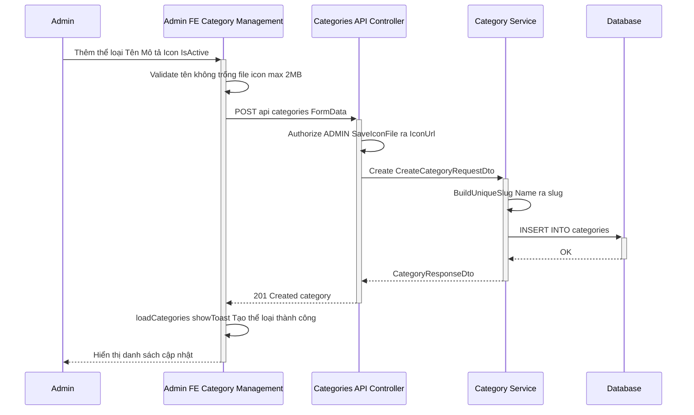
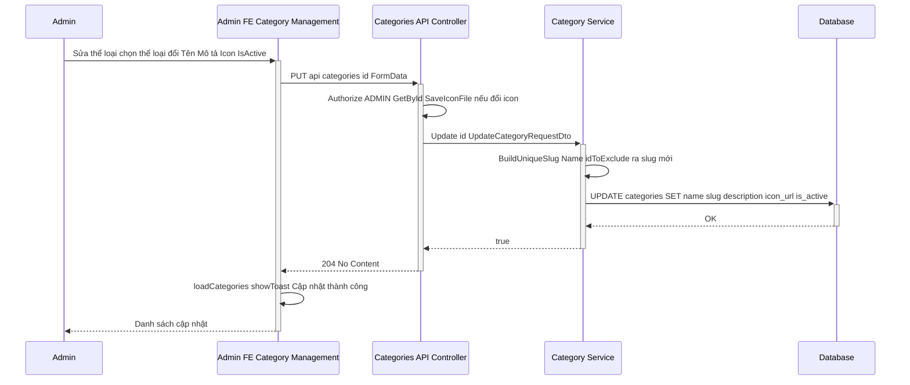
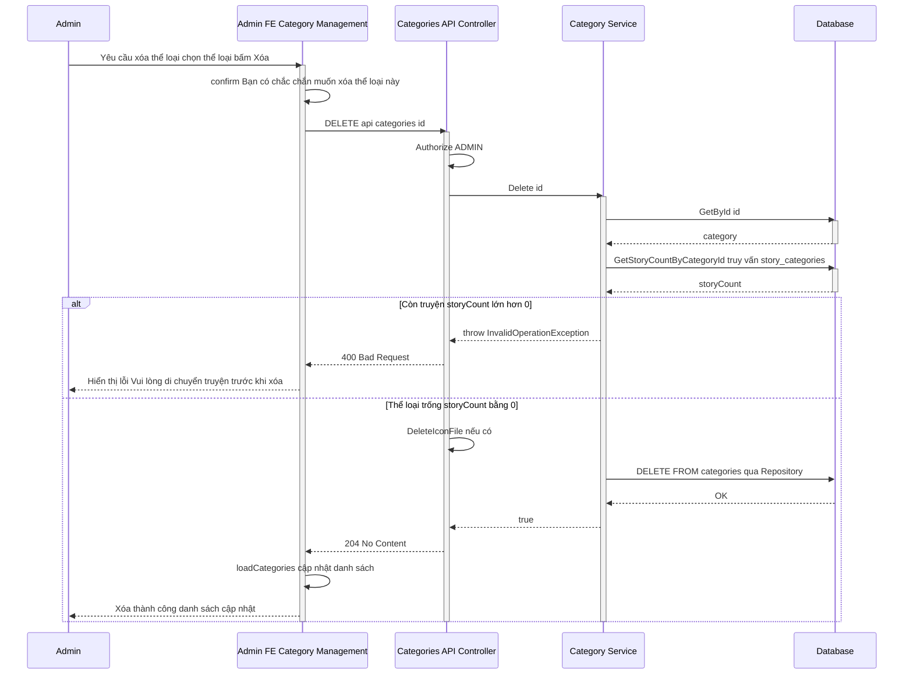

# Sequence Diagram – Quản lý thể loại truyện

Admin tổ chức lại cấu trúc kho truyện: **Thêm / Sửa / Xóa** thể loại. Luồng từ Admin → Admin FE (Category Management) → Backend API (CategoriesController) → Category Service → Database.

**File Draw.io:** Mở file **[sequence-diagram-category-management.drawio](./sequence-diagram-category-management.drawio)** trong [draw.io](https://app.diagrams.net/) (hoặc VS Code với extension Draw.io Integration) để chỉnh sửa. File có 3 trang: *1. Thêm thể loại*, *2. Sửa thể loại*, *3. Xóa thể loại (an toàn)*.

---

## Tổng quan luồng

- **Admin:** Người dùng vai trò ADMIN, thao tác trên giao diện quản lý thể loại.
- **Admin FE (Category Management):** Trang `pages/admin/category/CategoryManagement.jsx`, gọi `categoryApi` (createCategory, updateCategory, deleteCategory).
- **Categories API:** Controller `api/categories` – POST (tạo), PUT `{id}` (sửa), DELETE `{id}` (xóa). Yêu cầu `[Authorize(Roles = "ADMIN")]`.
- **Category Service:** `CategoryService` – tạo slug, kiểm tra truyện trước khi xóa, ghi DB.
- **Database:** Bảng `categories`, `story_categories` (quan hệ nhiều-nhiều truyện–thể loại).

---

## 1. Thêm thể loại mới

Admin nhập Tên, Mô tả, Icon (tùy chọn), bật/tắt trạng thái. Backend tạo slug tự động từ tên (ví dụ: "Tiên Hiệp" → "tien-hiep"), đảm bảo slug duy nhất.

---

## 2. Sửa thể loại

Admin chọn thể loại → Sửa. Có thể đổi tên (slug được tạo lại duy nhất), mô tả, icon, trạng thái active.

---

## 3. Xóa thể loại (an toàn – kiểm tra truyện)

Backend **không cho xóa** thể loại nếu còn truyện đang gán thể loại đó; trả lỗi để FE hiển thị yêu cầu di chuyển truyện trước.

---

## Ghi chú kỹ thuật

| Thành phần | Dự án |
|------------|--------|
| **FE** | `pages/admin/category/CategoryManagement.jsx`, `api/category/categoryApi.jsx` (createCategory, updateCategory, deleteCategory). |
| **API** | `AIStory.API/Controllers/CategoriesController.cs` – route `api/categories`, POST/PUT/DELETE. |
| **Service** | `Services/Implementations/CategoryService.cs` – Create (BuildUniqueSlug), Update, Delete (GetStoryCountByCategoryId → ném lỗi nếu > 0). |
| **DB** | Bảng `categories`; bảng trung gian `story_categories` (story_id, category_id) để đếm truyện theo thể loại. |

Lưu ý: Trong code FE hiện tại, `handleDeleteCategory` chỉ cập nhật state local (filter) mà chưa gọi `deleteCategory(id)` từ API. Để luồng xóa đúng như sơ đồ, cần sửa để gọi `deleteCategory(category.id)`, bắt 400 và hiển thị `message` từ server cho user.
