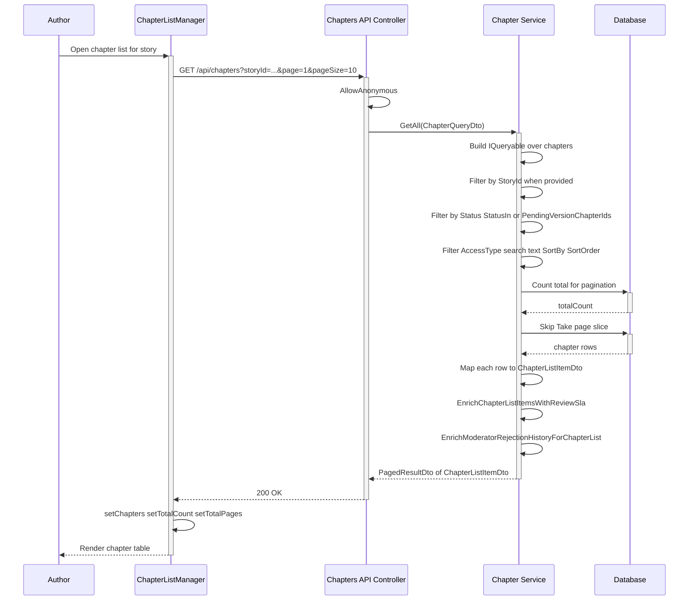
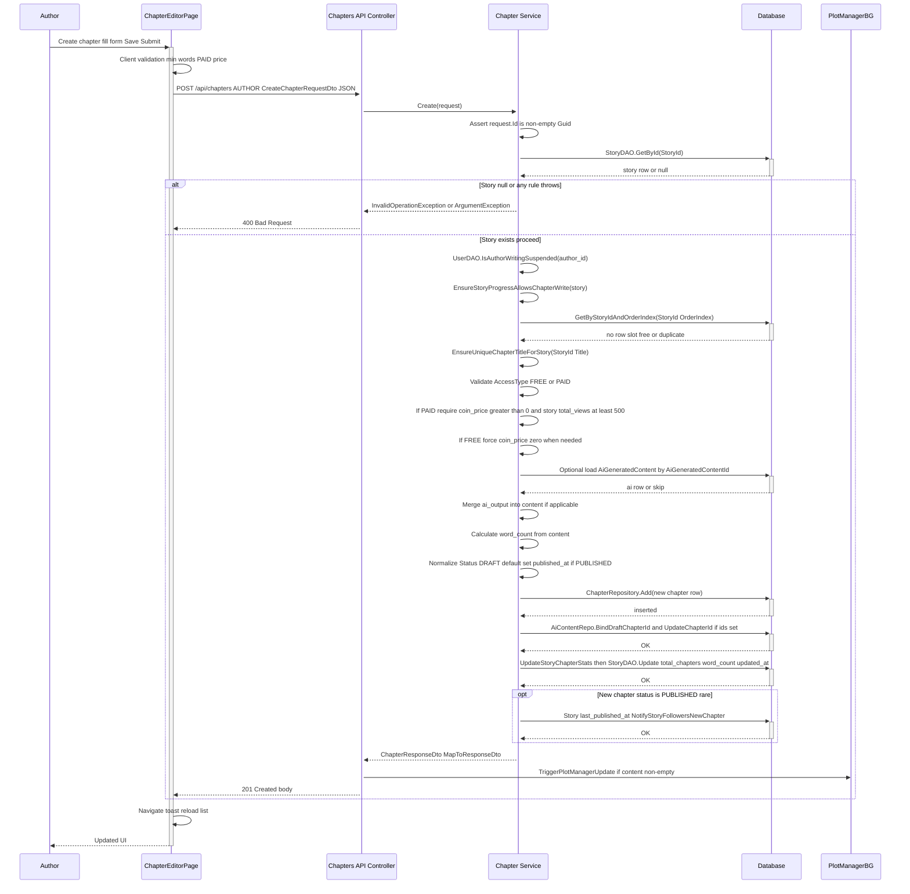
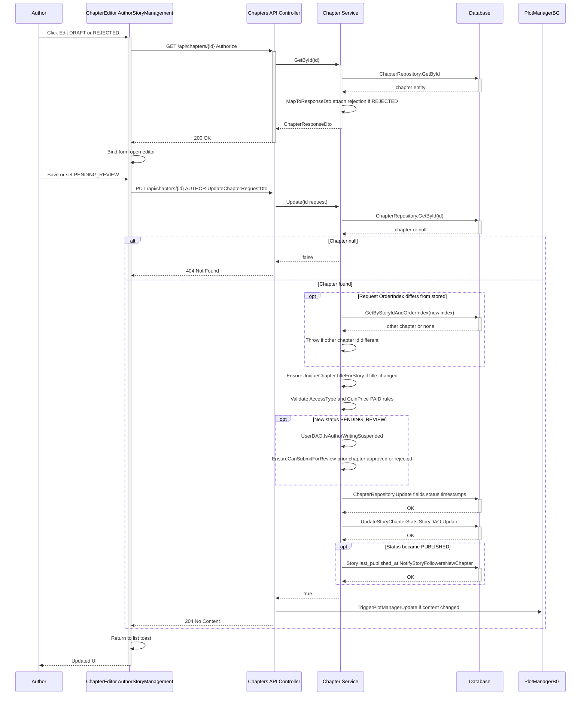
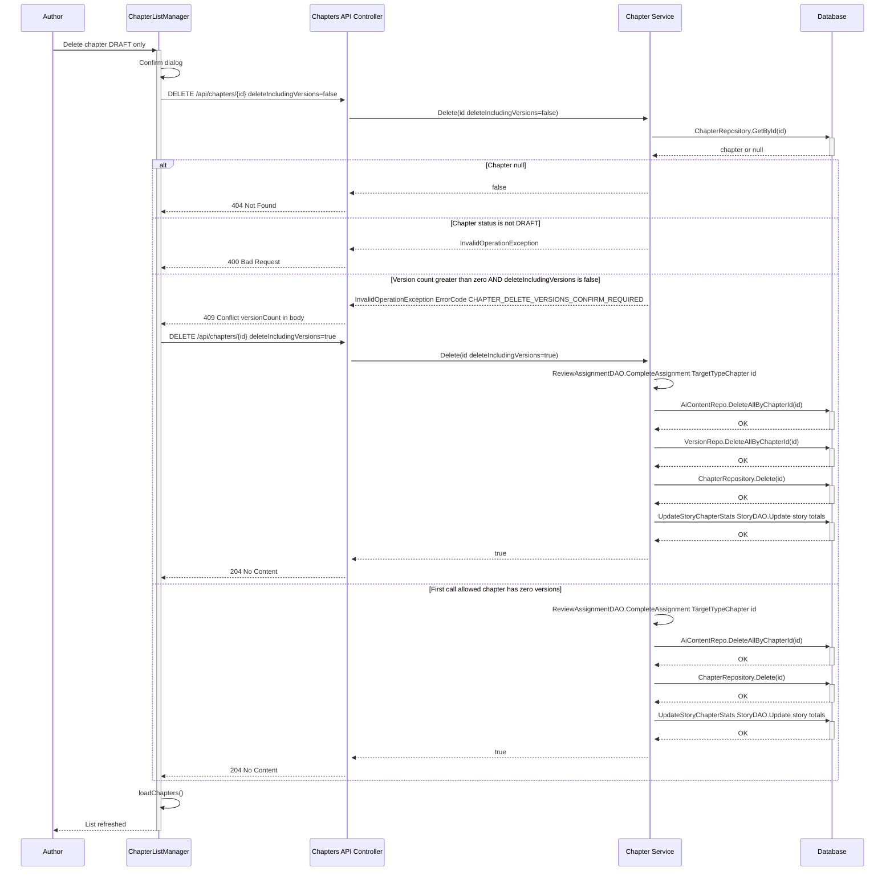
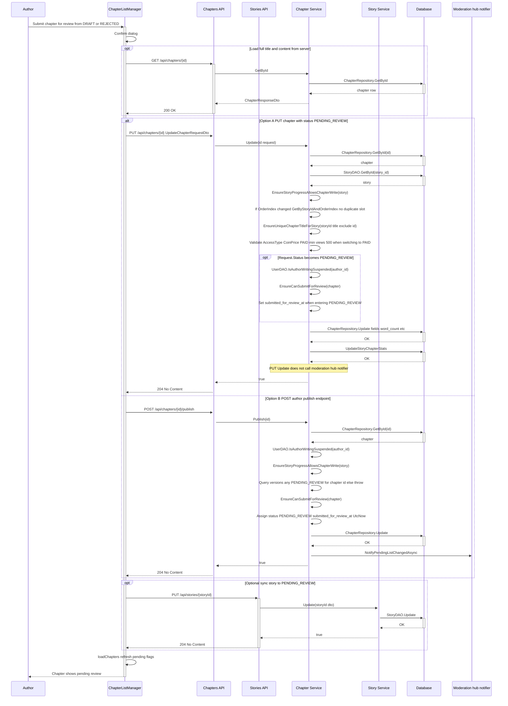
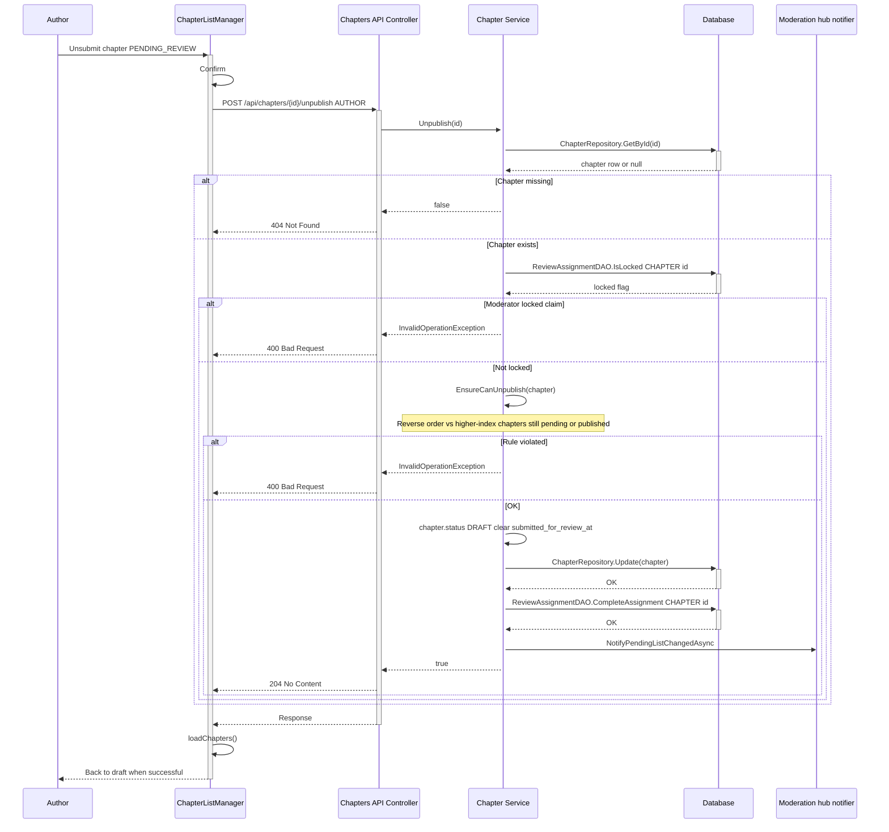
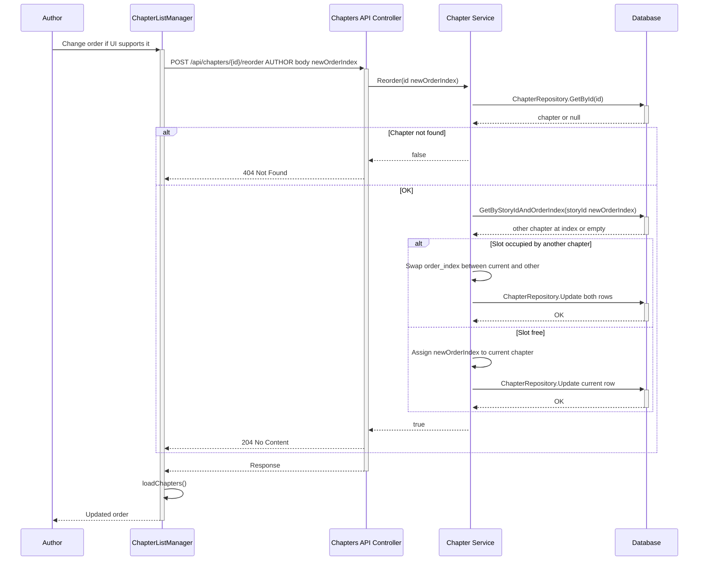
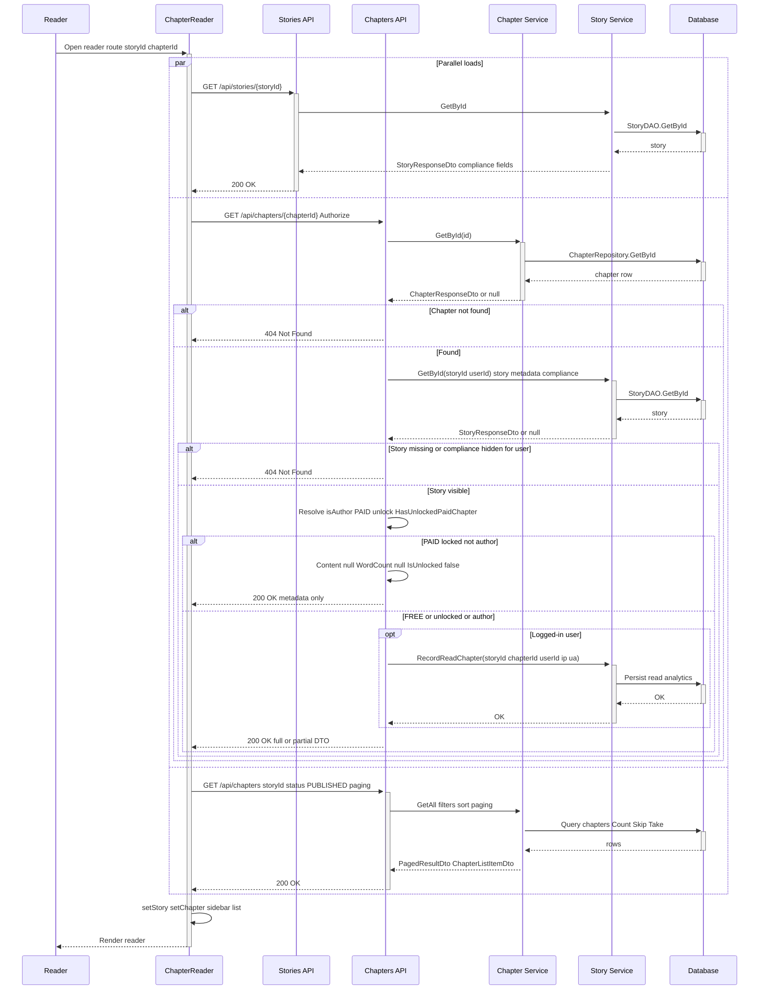

# Sequence Diagrams – Chapter Management

This document describes how **chapters** are listed, created, updated, deleted, submitted for review, and read. It maps flows to **`ChaptersController`**, **`ChapterService`**, and related code.

**Moderator flows** (claim, hàng đợi, duyệt/từ chối, escalation, lịch sử): see **[`sequence-diagram-moderator-moderation.md`](./sequence-diagram-moderator-moderation.md)**.

**Source of truth:** `AIStory.API/Controllers/ChaptersController.cs`, `Services/Implementations/ChapterService.cs`.

---

## How each section is organized

Every flow below follows the same layout:

1. **Summary** — what the user / client does.
2. **API** — HTTP method, path, auth.
3. **Chapter Service (step-by-step)** — ordered backend operations (matches how you break down **Create chapter**).
4. **Response** — status code and DTO / side effects.
5. **Sequence diagram** — Mermaid overview.

---

## Flow overview

- **Author:** `AUTHOR` role. UI: **My Stories** → `ChapterListManager.jsx`, `ChapterEditorPage.jsx`, `AuthorStoryManagement.jsx`.
- **Reader:** `ChapterReader.jsx`; list may be anonymous; **single chapter by id** requires login.
- **Moderator:** luồng duyệt nội dung và claim — **[`sequence-diagram-moderator-moderation.md`](./sequence-diagram-moderator-moderation.md)**.
- **Persistence:** `chapters`, `stories` (`total_chapters`, `word_count`, `last_published_at` updated in service paths below).

---

## 1. List chapters

### Summary

Author opens the chapter list for a story. Frontend calls `getChapters({ storyId, page, pageSize, ... })`.

### API

| Item | Value |
|------|--------|
| Method / path | `GET /api/chapters` |
| Auth | `[AllowAnonymous]` |
| Query | `ChapterQueryDto` (e.g. `storyId`, `status`, `page`, `pageSize`, filters) |

### Chapter Service (step-by-step)

1. **`GetAll(ChapterQueryDto query)`** — build `IQueryable` over chapters.
2. **Filter by `StoryId`** (when provided).
3. **Filter by status** — e.g. `Status`, `StatusIn`, or `PendingVersionChapterIds` for moderator-style pending lists.
4. **Filter by `AccessType`, search, sort** — `SortBy` / `SortOrder` (`order_index`, `created_at`, `published_at`, `title`, …).
5. **`Count()`** — total for pagination.
6. **`Skip` / `Take`** — page slice.
7. **Map each row** → **`ChapterListItemDto`** (via `MapToListItemDto`).
8. **`EnrichChapterListItemsWithReviewSla`** — SLA / claim fields for pending review.
9. **`EnrichModeratorRejectionHistoryForChapterList`** — rejection history on list items when applicable.
10. **Return** **`PagedResultDto<ChapterListItemDto>`** — `Items`, `TotalCount`, `Page`, `PageSize`.

### Response

- **`200 OK`** — body: **`PagedResultDto<ChapterListItemDto>`**.

### Sequence diagram

---

## 2. Create chapter (Author)

### Summary

Author creates a chapter (client-generated chapter `id` / UUID), fills title, content, order, access type, price, then saves. Backend persists one row in **`chapters`**.

### API

| Item | Value |
|------|--------|
| Method / path | `POST /api/chapters` |
| Auth | `[Authorize(Roles = "AUTHOR")]` |
| Body | **`CreateChapterRequestDto`** (JSON, `[FromBody]`) |

### Chapter Service (step-by-step)

1. **`request.Id` must be non-empty `Guid`** — otherwise throw **`ArgumentException`**.
2. **`StoryDAO.GetById(request.StoryId)`** — **story must exist**; else **`InvalidOperationException`** (“Story … not found”).
3. **`UserDAO.IsAuthorWritingSuspended(authorId)`** — if suspended, throw **`InvalidOperationException`**.
4. **`EnsureStoryProgressAllowsChapterWrite(story, …)`** — if story progress is **`HIATUS`** / **`COMPLETED`**, throw **`InvalidOperationException`**.
5. **`GetByStoryIdAndOrderIndex(StoryId, OrderIndex)`** — **must be no existing chapter** at that index (slot free); else **`InvalidOperationException`** (“order index … already exists”).
6. **`EnsureUniqueChapterTitleForStory(StoryId, Title, exclude: null)`** — title must not duplicate another chapter in the same story.
7. **Validate `AccessType`** — `FREE` or `PAID`; normalize default **`FREE`**.
8. **If `PAID`:** **`coin_price` > 0**; **`story.total_views` ≥ 500** — else **`ArgumentException`** / **`InvalidOperationException`** per code.
9. **If `FREE`:** force **`coin_price = 0`** when needed.
10. **Resolve content** — optionally fill from **`ai_generated_content`** when **`AiGeneratedContentId`** is set and output matches story.
11. **Compute `word_count`** from content.
12. **Normalize `Status`** from request — allowed: `DRAFT`, `PENDING_REVIEW`, `REJECTED`, `PUBLISHED`, `HIDDEN`, `ARCHIVED`; default **`DRAFT`**; if `PUBLISHED`, set **`published_at`** on the new row.
13. **`ChapterRepository.Add(chapter)`** — persist with **`status`** = **`DRAFT`** or **`PENDING_REVIEW`** / other valid value from request (typically **`DRAFT`** or **`PENDING_REVIEW`** from UI).
14. **`_aiContentRepository.BindDraftChapterId`** / **`UpdateChapterId`** — link AI draft rows when applicable.
15. **`UpdateStoryChapterStats(storyId)`** — recompute **`stories.total_chapters`**, **`stories.word_count`** (sum of chapter `word_count`), **`stories.updated_at`** via **`StoryDAO.Update`**.
16. **If new chapter `status == PUBLISHED`** (unusual on create): update **`story.last_published_at`**, **`StoryDAO.Update(story)`**, **`NotificationDAO.NotifyStoryFollowersNewChapter`** (and related), SignalR push as implemented.
17. **Return** **`ChapterResponseDto`** (`MapToResponseDto`).

### Response

- **`201 Created`** — body: **`ChapterResponseDto`**; **`Location`** header to resource.
- **`400 Bad Request`** — validation / business rule failures.
- **Controller (after create):** **`TriggerPlotManagerUpdate`** (async) if content is non-empty — does not block the HTTP response.

### Sequence diagram

---

## 3. Update chapter (Author)

### Summary

Author loads a chapter, edits fields, saves. May set status to **`PENDING_REVIEW`** (submit for review) via **`PUT`**.

### API

| Item | Value |
|------|--------|
| Load | `GET /api/chapters/{id}` — `[Authorize]` |
| Save | `PUT /api/chapters/{id}` — `[Authorize(Roles = "AUTHOR")]`, **`UpdateChapterRequestDto`** |

### Chapter Service (step-by-step)

1. **`ChapterRepository.GetById(id)`** — chapter **must exist**; else **`Update`** returns false → **404**.
2. **If `OrderIndex` changes** — **`GetByStoryIdAndOrderIndex`** must not point to **another** chapter id; else **`InvalidOperationException`**.
3. **`EnsureUniqueChapterTitleForStory`** when title changes.
4. **Validate `AccessType` / `CoinPrice`** — same PAID rules as create when switching to or staying PAID.
5. **If `request.Status` → `PENDING_REVIEW`:** **`UserDAO.IsAuthorWritingSuspended`**, **`EnsureCanSubmitForReview(chapter)`** (sequential chapter rules).
6. **`ChapterRepository.Update(chapter)`** — apply title, content, status, `submitted_for_review_at` / `published_at` transitions per status change.
7. **`UpdateStoryChapterStats(storyId)`** — refresh **`stories.total_chapters`**, **`stories.word_count`**.
8. **If status becomes `PUBLISHED`** (from update path): **`story.last_published_at`**, notifications to followers as in service.
9. **Return** **`true`** / **`false`**.

### Response

- **`204 No Content`** — update succeeded.
- **`404 Not Found`** — chapter id unknown.
- **`400 Bad Request`** — business validation.

### Sequence diagram

---

## 4. Delete chapter (Author)

### Summary

Hard delete of a **DRAFT** chapter. If **`chapter_versions`** exist, first call may return **409** until user confirms **`deleteIncludingVersions=true`**.

### API

| Item | Value |
|------|--------|
| Method / path | `DELETE /api/chapters/{id}?deleteIncludingVersions={bool}` |
| Auth | `[Authorize(Roles = "AUTHOR")]` |

### Chapter Service (step-by-step)

1. **`GetById(id)`** — if null → return false (**404**).
2. **Chapter `status` must be `DRAFT`** — else **`InvalidOperationException`**.
3. **Count versions** — if **> 0** and **`deleteIncludingVersions == false`** → throw with **`ErrorCode = CHAPTER_DELETE_VERSIONS_CONFIRM_REQUIRED`** (**409**).
4. **`ReviewAssignmentDAO.CompleteAssignment(CHAPTER, id)`** (best effort).
5. **`_aiContentRepository.DeleteAllByChapterId(id)`**.
6. If versions: **`DeleteAllByChapterId`** on version repository.
7. **`ChapterRepository.Delete(id)`**.
8. **`UpdateStoryChapterStats(storyId)`** — update **`total_chapters`**, **`word_count`** on story.

### Response

- **`204 No Content`** — deleted.
- **`404`** — not found.
- **`409 Conflict`** — versions present; client must retry with **`deleteIncludingVersions=true`**.

### Sequence diagram

---

## 5. Submit chapter for review (Author — “Publish” in UI)

### Summary

Author submits chapter for moderation → chapter **`PENDING_REVIEW`**. Either **`PUT`** with status or **`POST .../publish`**.

### API

| Path A | `PUT /api/chapters/{id}` with `Status = PENDING_REVIEW` |
| Path B | `POST /api/chapters/{id}/publish` → **`ChapterService.Publish`** |
| Optional | `PUT /api/stories/{storyId}` — story also **`PENDING_REVIEW`** |

### Chapter Service — Path A (`Update`)

1. Same as **§3** when **`newStatus == PENDING_REVIEW`**: suspension, **`EnsureCanSubmitForReview`**, no conflicting pending **version** on same chapter.
2. **`ChapterRepository.Update`** — `status`, **`submitted_for_review_at`**, etc.
3. **`UpdateStoryChapterStats`**.

### Chapter Service — Path B (`Publish`)

1. **`GetById`** — must exist.
2. **`UserDAO.IsAuthorWritingSuspended`**, **`EnsureStoryProgressAllowsChapterWrite`**.
3. **No version in `PENDING_REVIEW`** for this chapter.
4. **`EnsureCanSubmitForReview(chapter)`**.
5. **`chapter.status = PENDING_REVIEW`**, **`submitted_for_review_at = UtcNow`**.
6. **`ChapterRepository.Update`**.
7. **`_moderationHubNotifier.NotifyPendingListChangedAsync`**.

### Response

- **`204 No Content`** — typical success for publish/unpublish endpoints.
- **`400 Bad Request`** — rule violations.

### Sequence diagram

---

## 6. Unsubmit chapter (Author)

### API

`POST /api/chapters/{id}/unpublish` — **`ChapterService.Unpublish`**.

### Chapter Service (step-by-step)

1. **`GetById`** — null → false (**404**).
2. **`ReviewAssignmentDAO.IsLocked(CHAPTER, id)`** — if locked → **`InvalidOperationException`** (**400**).
3. **`EnsureCanUnpublish(chapter)`** — reverse order vs higher-index chapters still pending/published.
4. **`chapter.status = DRAFT`**, clear **`submitted_for_review_at`**.
5. **`ChapterRepository.Update`**.
6. **`ReviewAssignmentDAO.CompleteAssignment(CHAPTER, id)`**.
7. **`NotifyPendingListChangedAsync`**.

### Response

- **`204 No Content`** on success.
- **`400`** / **`404`** as above.

### Sequence diagram

---

## 7. Reorder chapters (Author)

### API

`POST /api/chapters/{id}/reorder` — body **`newOrderIndex`** (JSON number).

### Chapter Service (step-by-step)

1. **`GetById(id)`** — null → false (**404**).
2. **`GetByStoryIdAndOrderIndex(storyId, newOrderIndex)`** — if another chapter occupies index, **swap** `order_index` between the two; else assign **`newOrderIndex`** to current chapter.
3. **`ChapterRepository.Update`** (one or two rows).

### Response

- **`204 No Content`**.

### Sequence diagram

---

## 8. Read chapter (Reader)

### API

- `GET /api/stories/{storyId}` — story metadata.
- `GET /api/chapters/{chapterId}` — **`[Authorize]`**; paid unlock, compliance, **`RecordReadChapter`** when allowed.
- `GET /api/chapters?storyId=...&status=PUBLISHED&...` — sidebar list.

### ChaptersController + ChapterService (step-by-step for GET by id)

1. **`ChapterService.GetById(id)`** — map to **`ChapterResponseDto`**; attach rejection fields if **`REJECTED`**.
2. Load **story** via **`StoryService.GetById`** — **compliance hidden** rules for non-author.
3. **Paid chapter:** if not author and not unlocked → strip **`Content`**, set **`IsUnlocked`**.
4. Else **record read** — **`StoryService.RecordReadChapter`**.
5. Return **`200 OK`**.

### Response

- **`200 OK`** — **`ChapterResponseDto`** (content may be null when locked).

### Sequence diagram

---

## 9. Chapter versions (Author) — endpoint summary

| Action | Method | Route |
|--------|--------|--------|
| List | GET | `/api/chapters/{chapterId}/versions` |
| Detail | GET | `/api/chapters/{chapterId}/versions/{versionId}` |
| Create | POST | `/api/chapters/{chapterId}/versions` |
| Update | PUT | `/api/chapters/{chapterId}/versions/{versionId}` |
| Delete | DELETE | `/api/chapters/{chapterId}/versions/{versionId}` |
| Submit | POST | `/api/chapters/{chapterId}/versions/{versionId}/submit` |
| Unsubmit | POST | `/api/chapters/{chapterId}/versions/{versionId}/unsubmit` |

See **`ChapterVersionService`** for step-by-step rules (author match, DRAFT-only edits, single pending version, sequential rules, story progress locks).

---

## Conditions checklist (compact)

| Flow | Key rules |
|------|-----------|
| List | Anonymous OK; returns **`PagedResultDto<ChapterListItemDto>`**. |
| Create | Story exists; **free `order_index`**; unique title; PAID + views; **`UpdateStoryChapterStats`**; optional **`last_published_at`** if **`PUBLISHED`**. |
| Update | Exists; order/title/access rules; **`PENDING_REVIEW`** → suspension + sequential; **`UpdateStoryChapterStats`**. |
| Delete | **`DRAFT` only**; **409** if versions without confirm. |
| Submit | **`PENDING_REVIEW`** via **`PUT`** or **`Publish`**; hub notify. |
| Unpublish | Not locked; reverse order. |
| Mod (toàn bộ) | **[`sequence-diagram-moderator-moderation.md`](./sequence-diagram-moderator-moderation.md)** — claim, hàng đợi, duyệt/từ chối, escalation. |

---

## API endpoints reference (`ChaptersController`)

| Method | Endpoint | Auth | Description |
|--------|----------|------|-------------|
| POST | `/api/chapters` | AUTHOR | Create chapter (JSON body) |
| GET | `/api/chapters` | AllowAnonymous | List → **`PagedResultDto<ChapterListItemDto>`** |
| GET | `/api/chapters/{id}` | **Authorize** | Get by id |
| GET | `/api/chapters/story/{storyId}` | AllowAnonymous | By story |
| GET | `/api/chapters/story/{storyId}/order/{orderIndex}` | AllowAnonymous | By story + order |
| PUT | `/api/chapters/{id}` | AUTHOR | Update |
| DELETE | `/api/chapters/{id}` | AUTHOR | Delete draft (`deleteIncludingVersions`) |
| POST | `/api/chapters/{id}/publish` | AUTHOR | Submit → **`PENDING_REVIEW`** |
| POST | `/api/chapters/{id}/unpublish` | AUTHOR | Back to **`DRAFT`** |
| POST | `/api/chapters/{id}/reorder` | AUTHOR | Reorder |
| GET | `/api/chapters/{id}/rejection-reason` | AUTHOR | Rejection info |
| * | `/api/chapters/{chapterId}/versions/...` | AUTHOR | Versions |

Moderator: xem **[`sequence-diagram-moderator-moderation.md`](./sequence-diagram-moderator-moderation.md)** (đầy đủ route `api/moderator` và escalation admin).
