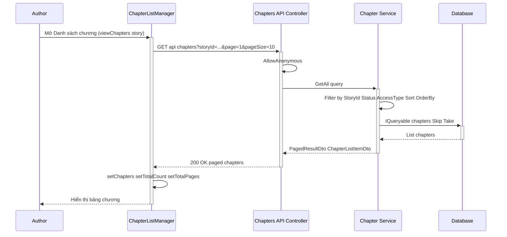
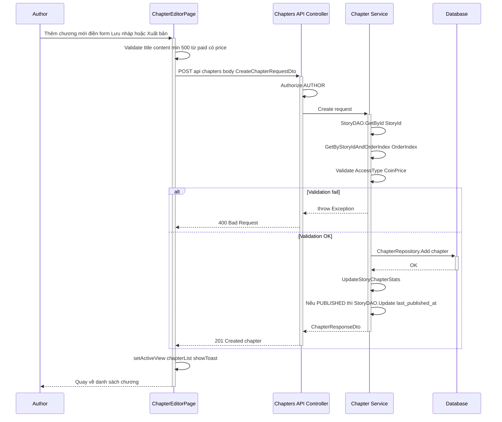
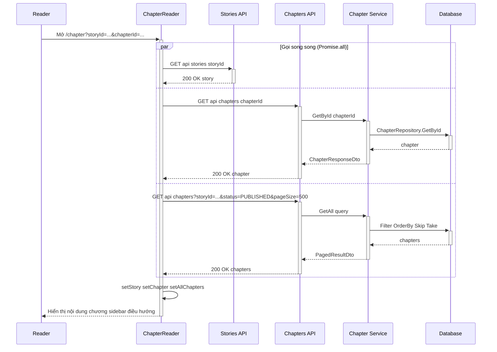

# Sequence Diagram – Quản lý chương (Chapter)

Tác giả (AUTHOR) tạo, sửa, xóa, xuất bản (submit for review), hủy xuất bản chương. Admin duyệt (approve = publish) hoặc từ chối (reject = update status REJECTED). Người đọc xem chương đã xuất bản. Luồng từ Author/Reader → FE → Chapters API (ChaptersController) → Chapter Service → Database.

---

## Tổng quan luồng

- **Author:** Người dùng vai trò AUTHOR, thao tác trên trang Truyện của tôi → Danh sách chương (ChapterListManager) hoặc Trang soạn chương (ChapterEditorPage).
- **Author FE:** `AuthorStoryManagement.jsx`, `ChapterListManager.jsx`, `ChapterEditorPage.jsx`; gọi `chapterApi` (createChapter, updateChapter, deleteChapter, publishChapter, unpublishChapter, getChapters, getChapterById).
- **Reader FE:** `ChapterReader.jsx` – đọc chương qua `getChapterById`, `getChapters` (status PUBLISHED).
- **Chapters API:** Controller `api/chapters` – POST (tạo), GET (danh sách/chi tiết), PUT `{id}` (sửa), DELETE `{id}` (xóa), POST `{id}/publish`, POST `{id}/unpublish`, POST `{id}/reorder`. Authorize AUTHOR cho POST/PUT/DELETE/publish/unpublish/reorder; AllowAnonymous cho GET.
- **Chapter Service:** `ChapterService` – validate story tồn tại, orderIndex không trùng, accessType/coinPrice; Create/Update/Delete; Publish (status PUBLISHED); Unpublish (status DRAFT); Reorder; UpdateStoryChapterStats.
- **Database:** Bảng `chapters`, `stories` (cập nhật total_chapters, word_count, last_published_at).

---

## 1. Lấy danh sách chương (List chapters)

Author mở Danh sách chương của truyện. FE gọi `getChapters({ storyId, page, pageSize })`. API cho phép xem không cần đăng nhập.



---

## 2. Thêm chương (Author)

Author chọn truyện → Thêm chương mới → điền form (số chương, tên, nội dung, chế độ public/paid, giá) → Lưu nháp hoặc Xuất bản. Backend kiểm tra story tồn tại, orderIndex chưa tồn tại, accessType/coinPrice hợp lệ.



*Ghi chú:* Khung **alt** phân nhánh khi validation lỗi (400) vs thành công (201). Khung **opt** mô tả bước chỉ chạy khi tạo chương với status PUBLISHED.

---

## 3. Chỉnh sửa chương (Author)

Author bấm Chỉnh sửa trên một chương (chỉ khi status ≠ PENDING_REVIEW). FE gọi `getChapterById` lấy đầy đủ, hiển thị form, khi lưu gọi `updateChapter`.

```mermaid
sequenceDiagram
    participant Author
    participant FE as ChapterEditorPage / AuthorStoryManagement
    participant API as Chapters API Controller
    participant Svc as Chapter Service
    participant DB as Database

    Author->>+FE: Bấm Chỉnh sửa chương (chương status DRAFT/REJECTED)
    FE->>+API: GET api chapters id
    API->>API: AllowAnonymous
    API->>+Svc: GetById id
    Svc->>+DB: ChapterRepository.GetById
    DB-->>-Svc: chapter
    Svc-->>-API: ChapterResponseDto
    API-->>-FE: 200 OK chapter
    FE->>FE: setCurrentChapter mapChapter setActiveView editChapter
    Author->>FE: Sửa form Lưu nháp/Xuất bản
    FE->>+API: PUT api chapters id body UpdateChapterRequestDto
    API->>API: Authorize AUTHOR
    API->>+Svc: Update id request
    Svc->>Svc: GetById chapter tồn tại
    alt chapter null
        Svc-->>API: false
        API-->>FE: 404 Not Found
    else chapter tồn tại
        opt OrderIndex thay đổi
            Svc->>Svc: GetByStoryIdAndOrderIndex kiểm tra chưa trùng
        end
        Svc->>Svc: Validate AccessType CoinPrice
        Svc->>+DB: ChapterRepository.Update
        DB-->>-Svc: OK
        Svc->>Svc: UpdateStoryChapterStats
        opt status chuyển sang PUBLISHED
            Svc->>Svc: StoryDAO.Update last_published_at
        end
        Svc-->>-API: true
        API-->>-FE: 204 No Content
    end
    FE->>FE: setActiveView chapterList showToast
    FE-->>-Author: Quay về danh sách chương
```



*Ghi chú:* **alt** phân nhánh 404 (chapter null) vs 204. **opt** OrderIndex chỉ chạy khi user đổi thứ tự chương; **opt** PUBLISHED chỉ chạy khi cập nhật status sang PUBLISHED.

---

## 4. Xóa chương (Author) – Xóa cứng (Hard delete)

Author bấm Xóa chương (chỉ khi status ≠ PENDING_REVIEW). Backend thực hiện **xóa cứng**: xóa vật lý bản ghi khỏi bảng `chapters`. FE cần gọi `deleteChapter(id)`; hiện tại `ChapterListManager.handleDeleteChapter` chỉ cập nhật local state, chưa gọi API.

```mermaid
sequenceDiagram
    participant Author
    participant FE as ChapterListManager
    participant API as Chapters API Controller
    participant Svc as Chapter Service
    participant DB as Database

    Author->>+FE: Bấm Xóa chương (status DRAFT/REJECTED)
    FE->>FE: confirm Bạn có chắc muốn xóa chương này
    FE->>+API: DELETE api chapters id
    API->>API: Authorize AUTHOR
    API->>+Svc: Delete id
    Svc->>Svc: GetById chapter
    alt chapter null
        Svc-->>API: false
        API-->>-FE: 404 Not Found
    else chapter tồn tại
        Svc->>+DB: ChapterRepository.Delete ChapterDAO.Remove chapter
        DB-->>-Svc: OK
        opt storyId có giá trị
            Svc->>Svc: UpdateStoryChapterStats story total_chapters word_count
        end
        Svc-->>-API: true
        API-->>-FE: 204 No Content
    end
    FE->>FE: loadChapters cập nhật danh sách
    FE-->>-Author: Xóa thành công danh sách cập nhật
```

*Ghi chú:* **alt** phân nhánh 404 (không tìm thấy chương) vs 204. **opt** UpdateStoryChapterStats chỉ chạy khi chapter thuộc story (storyId != null).

*Lưu ý:* `ChapterListManager` hiện chỉ `setChapters(prev => prev.filter(ch => ch.id !== chapterId))` mà không gọi `deleteChapter`. Cần bổ sung gọi `deleteChapter(id)` để xóa thực sự trên backend.

---

## 5. Xuất bản chương – Gửi duyệt (Author)

Author bấm Xuất bản trên chương DRAFT. FE gọi `updateChapter(id, { title, content, status: 'PENDING_REVIEW' })`, sau đó `updateStory(storyId, { status: 'PENDING_REVIEW' })` để đồng bộ trạng thái truyện.

```mermaid
sequenceDiagram
    participant Author
    participant FE as ChapterListManager
    participant API as Chapters API
    participant StoryAPI as Stories API
    participant Svc as Chapter Service
    participant StorySvc as Story Service
    participant DB as Database

    Author->>+FE: Bấm Xuất bản chương DRAFT
    FE->>FE: confirm Bạn có chắc gửi chương lên duyệt
    alt User xác nhận
        opt Cần title/content từ server
            FE->>+API: GET api chapters id
            API-->>-FE: 200 OK chapter
        end
        FE->>+API: PUT api chapters id body status PENDING_REVIEW
    API->>API: Authorize AUTHOR
    API->>+Svc: Update id status PENDING_REVIEW
    Svc->>+DB: ChapterRepository.Update status PENDING_REVIEW
    DB-->>-Svc: OK
    Svc->>Svc: UpdateStoryChapterStats
    Svc-->>-API: true
    API-->>-FE: 204 No Content
    FE->>+StoryAPI: PUT api stories storyId status PENDING_REVIEW
    StoryAPI->>+StorySvc: Update story status PENDING_REVIEW
    StorySvc->>+DB: StoryDAO.Update
    DB-->>-StorySvc: OK
    StorySvc-->>-StoryAPI: true
    StoryAPI-->>-FE: 204 No Content
    FE->>FE: loadChapters setHasPendingReviewChapter
    FE-->>-Author: Chương chuyển Chờ duyệt
    else User hủy
        FE-->>-Author: Đóng dialog không gửi
    end
```

*Ghi chú:* **alt** User xác nhận vs hủy. **opt** GET chapter chỉ khi FE cần lấy title/content đầy đủ trước khi PUT.

---

## 6. Hủy xuất bản (Author)

Author bấm Hủy xuất bản trên chương PENDING_REVIEW. Backend gọi `Unpublish` → chuyển status về DRAFT.

```mermaid
sequenceDiagram
    participant Author
    participant FE as ChapterListManager
    participant API as Chapters API Controller
    participant Svc as Chapter Service
    participant DB as Database

    Author->>+FE: Bấm Hủy xuất bản chương PENDING_REVIEW
    FE->>FE: confirm Bạn có chắc hủy và đưa về bản nháp
    FE->>+API: POST api chapters id unpublish
    API->>API: Authorize AUTHOR
    API->>+Svc: Unpublish id
    Svc->>Svc: GetById chapter
    alt chapter null
        Svc-->>API: false
        API-->>-FE: 404 Not Found
    else chapter tồn tại
        Svc->>Svc: chapter.status = DRAFT
        Svc->>+DB: ChapterRepository.Update
        DB-->>-Svc: OK
        Svc-->>-API: true
        API-->>-FE: 204 No Content
    end
    FE->>FE: loadChapters setHasPendingReviewChapter
    FE-->>-Author: Chương về Bản nháp
```

*Ghi chú:* **alt** phân nhánh 404 vs 204.

---

## 7. Duyệt chương – Xuất bản (Admin)

Admin duyệt chương trong màn duyệt. FE gọi `publishChapter(id)` → POST `api/chapters/{id}/publish`. Backend chuyển status sang PUBLISHED, cập nhật published_at, story.last_published_at.

```mermaid
sequenceDiagram
    participant Admin
    participant FE as PublicationDetailModal / Admin FE
    participant API as Chapters API Controller
    participant Svc as Chapter Service
    participant DB as Database

    Admin->>+FE: Bấm Duyệt chương
    FE->>+API: POST api chapters id publish
    API->>API: Authorize AUTHOR (Admin cũng có AUTHOR hoặc ADMIN)
    API->>+Svc: Publish id
    Svc->>Svc: GetById chapter
    alt chapter null
        Svc-->>API: false
        API-->>-FE: 404 Not Found
    else chapter tồn tại
        Svc->>Svc: chapter.status = PUBLISHED published_at = Now
        Svc->>+DB: ChapterRepository.Update
        DB-->>-Svc: OK
        opt storyId có giá trị
            Svc->>Svc: StoryDAO.Update story last_published_at
        end
        Svc-->>-API: true
        API-->>-FE: 204 No Content
    end
    FE->>FE: onApprove loadPublications
    FE-->>-Admin: Chương đã xuất bản
```

*Ghi chú:* **alt** 404 vs 204. **opt** cập nhật story last_published_at chỉ khi chapter có storyId.

---

## 8. Từ chối duyệt chương (Admin)

Admin từ chối chương. FE gọi `rejectChapter(id)` → thực chất là `updateChapter(id, { status: 'REJECTED', title, content })`.

```mermaid
sequenceDiagram
    participant Admin
    participant FE as PublicationDetailModal
    participant API as Chapters API Controller
    participant Svc as Chapter Service
    participant DB as Database

    Admin->>+FE: Bấm Từ chối nhập lý do
    FE->>+API: PUT api chapters id body status REJECTED
    API->>API: Authorize AUTHOR
    API->>+Svc: Update id status REJECTED
    Svc->>Svc: GetById chapter
    alt chapter null
        Svc-->>API: false
        API-->>-FE: 404 Not Found
    else chapter tồn tại
        Svc->>Svc: chapter.status = REJECTED published_at = null
        Svc->>+DB: ChapterRepository.Update
        DB-->>-Svc: OK
        Svc->>Svc: UpdateStoryChapterStats
        Svc-->>-API: true
        API-->>-FE: 204 No Content
    end
    FE->>FE: onReject loadPublications
    FE-->>-Admin: Chương bị từ chối
```

*Ghi chú:* **alt** 404 vs 204.

---

## 9. Sắp xếp lại chương (Author)

Author đổi thứ tự chương. Backend hỗ trợ POST `api/chapters/{id}/reorder` với body `newOrderIndex`. FE hiện chưa tích hợp nút Reorder.

```mermaid
sequenceDiagram
    participant Author
    participant FE as ChapterListManager
    participant API as Chapters API Controller
    participant Svc as Chapter Service
    participant DB as Database

    Author->>+FE: Kéo thả / chọn thứ tự mới (chưa có UI)
    FE->>+API: POST api chapters id reorder body newOrderIndex
    API->>API: Authorize AUTHOR
    API->>+Svc: Reorder id newOrderIndex
    Svc->>Svc: GetById chapter
    alt chapter null
        Svc-->>API: false
        API-->>-FE: 404 Not Found
    else chapter tồn tại
        Svc->>Svc: GetByStoryIdAndOrderIndex newOrderIndex
        alt Có chapter khác đang dùng newOrderIndex
            Svc->>Svc: Hoán đổi order_index 2 chapter
        else Không trùng
            Svc->>Svc: chapter.order_index = newOrderIndex
        end
        Svc->>+DB: ChapterRepository.Update (1 hoặc 2 chapter)
        DB-->>-Svc: OK
        Svc-->>-API: true
        API-->>-FE: 204 No Content
        FE->>FE: loadChapters
    end
    FE-->>-Author: Thứ tự đã cập nhật
```

*Ghi chú:* **alt** ngoài: chapter null → 404 vs tồn tại → xử lý reorder. **alt** trong: trùng orderIndex → hoán đổi 2 chapter, không trùng → cập nhật 1 chapter.

---

## 10. Đọc chương (Reader)

Người đọc mở trang đọc chương (query storyId, chapterId). FE gọi `getStoryById`, `getChapterById`, `getChapters({ storyId, status: 'PUBLISHED' })` để hiển thị nội dung và sidebar điều hướng.



---

## Điều kiện đầy đủ (kiểm tra theo code)

### 1. Lấy danh sách chương (GetAll)

| Tầng | Điều kiện | Nếu sai → Response / Hành vi |
|------|-----------|-----------------------------|
| **API** | AllowAnonymous. | Cho phép không đăng nhập. |
| **Service** | Filter by StoryId, Status, AccessType; Sort by order_index/created_at/published_at. | Trả PagedResultDto. |
| **Service** | UpdateStoryChapterStats không gọi trong GetAll. | Chỉ đọc. |

### 2. Thêm chương (Create)

| Tầng | Điều kiện | Nếu sai → Response / Hành vi |
|------|-----------|-----------------------------|
| **FE** | Validate title, content min 500 từ; PAID phải có price > 0. | Không gửi API. |
| **API** | [Authorize(Roles = "AUTHOR")]. | 401. |
| **Service** | StoryDAO.GetById(StoryId) != null. | 400 "Story with ID ... not found". |
| **Service** | GetByStoryIdAndOrderIndex(StoryId, OrderIndex) == null. | 400 "Chapter with order index ... already exists". |
| **Service** | AccessType FREE/PAID; PAID → coinPrice > 0. | 400 ArgumentException. |
| **Service** | Status mặc định DRAFT; nếu PUBLISHED thì published_at = Now. | 201 Created. |

### 3. Chỉnh sửa chương (Update)

| Tầng | Điều kiện | Nếu sai → Response / Hành vi |
|------|-----------|-----------------------------|
| **FE** | Chỉ cho sửa khi status ≠ PENDING_REVIEW. | Disable nút Chỉnh sửa. |
| **API** | [Authorize(Roles = "AUTHOR")]. | 401. |
| **Service** | GetById(id) != null. | 404. |
| **Service** | Nếu OrderIndex đổi → chưa có chapter khác dùng OrderIndex. | 400 "Chapter with order index ... already exists". |
| **Service** | Validate AccessType, CoinPrice. | 400. |
| **Service** | UpdateStoryChapterStats. | 204 No Content. |

### 4. Xóa chương (Delete) – Xóa cứng

| Tầng | Điều kiện | Nếu sai → Response / Hành vi |
|------|-----------|-----------------------------|
| **FE** | Chỉ cho xóa khi status ≠ PENDING_REVIEW. **Lưu ý:** hiện handleDeleteChapter chưa gọi deleteChapter API. | Cần bổ sung gọi API. |
| **API** | [Authorize(Roles = "AUTHOR")]. | 401. |
| **Service** | GetById(id) != null. | 404. |
| **Service** | ChapterRepository.Delete → ChapterDAO.Remove (hard delete). | 204 No Content. |
| **Service** | UpdateStoryChapterStats. | 204. |

### 5. Xuất bản chương (Submit PENDING_REVIEW)

| Tầng | Điều kiện | Nếu sai → Response / Hành vi |
|------|-----------|-----------------------------|
| **FE** | updateChapter(id, { title, content, status: 'PENDING_REVIEW' }); updateStory(storyId, { status: 'PENDING_REVIEW' }). | Đồng bộ chapter + story. |
| **API** | PUT chapters – Authorize AUTHOR. | 401. |
| **Service** | Update chapter status PENDING_REVIEW. | 204. |

### 6. Hủy xuất bản (Unpublish)

| Tầng | Điều kiện | Nếu sai → Response / Hành vi |
|------|-----------|-----------------------------|
| **API** | POST chapters/{id}/unpublish, Authorize AUTHOR. | 401. |
| **Service** | chapter.status = DRAFT; Update. | 204. |

### 7. Duyệt chương (Publish – Admin)

| Tầng | Điều kiện | Nếu sai → Response / Hành vi |
|------|-----------|-----------------------------|
| **API** | POST chapters/{id}/publish, Authorize AUTHOR. | 401. |
| **Service** | chapter.status = PUBLISHED; published_at = Now; StoryDAO.Update last_published_at. | 204. |

### 8. Sắp xếp (Reorder)

| Tầng | Điều kiện | Nếu sai → Response / Hành vi |
|------|-----------|-----------------------------|
| **API** | POST chapters/{id}/reorder body newOrderIndex, Authorize AUTHOR. | 401. |
| **Service** | Nếu có chapter khác dùng newOrderIndex → hoán đổi order_index; else cập nhật 1 chapter. | 204. |

---

## Tóm tắt API Endpoints

| Method | Endpoint | Auth | Mô tả |
|--------|----------|------|-------|
| POST | `/api/chapters` | AUTHOR | Tạo chương |
| GET | `/api/chapters` | AllowAnonymous | Danh sách (pagination, filter) |
| GET | `/api/chapters/{id}` | AllowAnonymous | Chi tiết chương |
| GET | `/api/chapters/story/{storyId}` | AllowAnonymous | Danh sách chương theo truyện |
| GET | `/api/chapters/story/{storyId}/order/{orderIndex}` | AllowAnonymous | Chương theo thứ tự |
| PUT | `/api/chapters/{id}` | AUTHOR | Cập nhật chương |
| DELETE | `/api/chapters/{id}` | AUTHOR | Xóa chương (hard delete) |
| POST | `/api/chapters/{id}/publish` | AUTHOR | Xuất bản (status PUBLISHED) |
| POST | `/api/chapters/{id}/unpublish` | AUTHOR | Hủy xuất bản (status DRAFT) |
| POST | `/api/chapters/{id}/reorder` | AUTHOR | Sắp xếp lại thứ tự |
