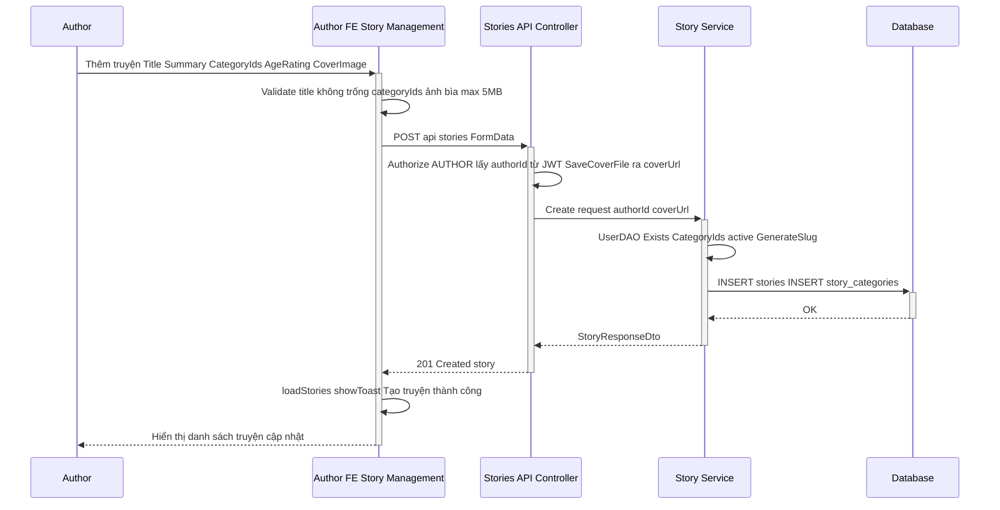
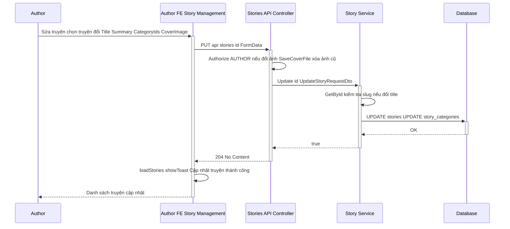
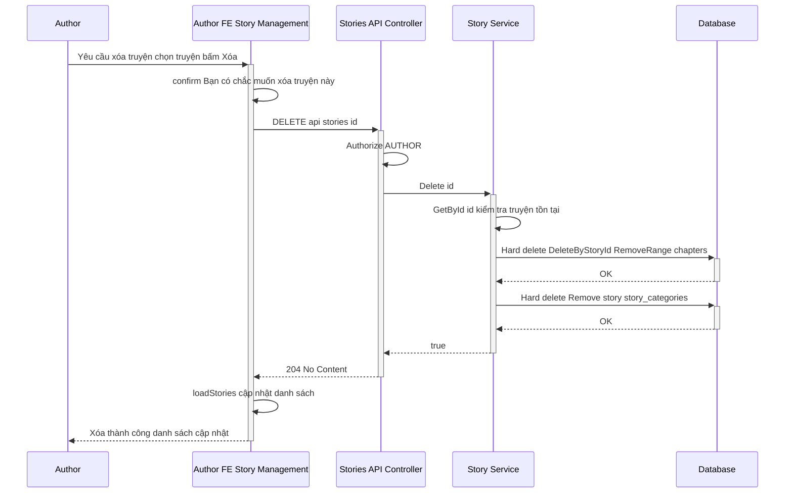
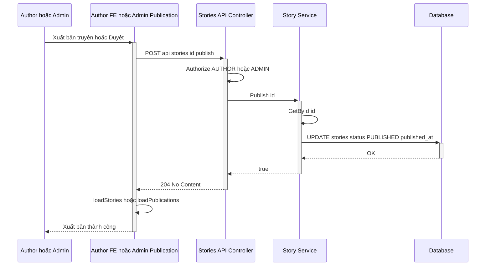
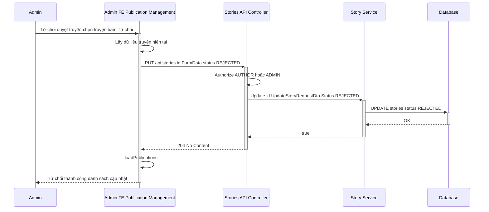
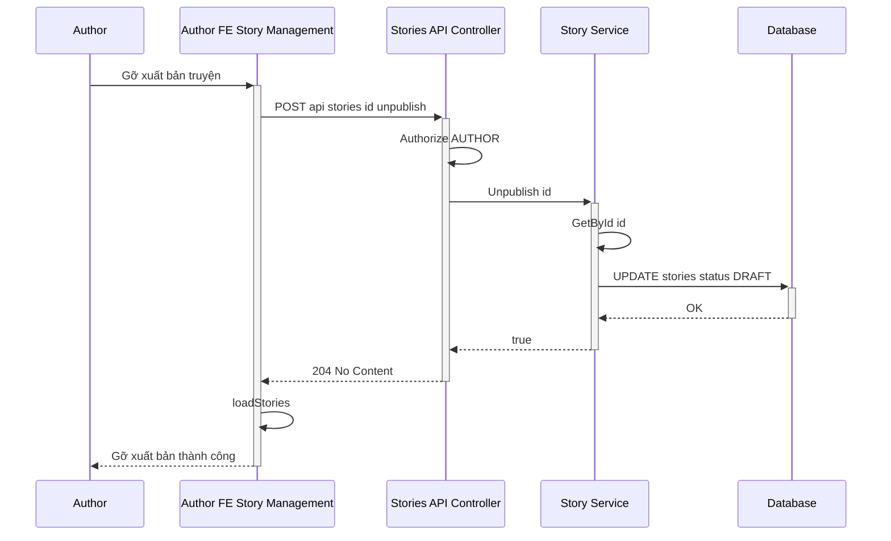

# Sequence Diagram – Quản lý truyện (Story)

Tác giả (AUTHOR) tạo, sửa, xóa, xuất bản truyện. Admin duyệt (approve = publish) hoặc từ chối (reject = update status REJECTED). Luồng từ Author/Admin → FE → Stories API (StoriesController) → Story Service → Database.

---

## Tổng quan luồng

- **Author:** Người dùng vai trò AUTHOR, thao tác trên trang Truyện của tôi (AuthorStoryManagement, StoryEditor).
- **Author FE:** Trang `pages/author/AuthorStoryManagement.jsx`, `StoryEditor.jsx`; gọi `storyApi` (createStory, updateStory, deleteStory, publishStory, unpublishStory).
- **Stories API:** Controller `api/stories` – POST (tạo), PUT `{id}` (sửa), DELETE `{id}` (xóa), POST `{id}/publish`, POST `{id}/unpublish`. Authorize AUTHOR cho tạo/sửa/xóa/publish/unpublish.
- **Story Service:** `StoryService` – validate author, category, slug; Create (GenerateSlug, Add story + story_categories); Update (UpdateStoryCategories); Delete (DeleteByStoryId chapters rồi Delete story); Publish/Unpublish (đổi status).
- **Database:** Bảng `stories`, `story_categories`, `chapters`.

---

## 1. Thêm truyện (Author)

Author nhập Tiêu đề, Tóm tắt, Thể loại, Độ tuổi, Tiến độ, Ảnh bìa (tùy chọn). Backend kiểm tra author tồn tại, ít nhất một thể loại, thể loại active; tạo slug từ title; status mặc định DRAFT.

---

## 2. Sửa truyện (Author)

Author chọn truyện, sửa thông tin (title, summary, categoryIds, ageRating, storyProgressStatus, coverImage). Backend cập nhật story và story_categories.

---

## 3. Xóa truyện (Author) – Xóa cứng (Hard delete)

Author chọn truyện và bấm Xóa. Backend thực hiện **xóa cứng (hard delete)**: xóa vật lý bản ghi khỏi DB (không dùng trường deleted_at hay status DELETED). Trình tự: xóa toàn bộ chapter thuộc truyện (RemoveRange), sau đó xóa bản ghi truyện (Remove); bảng `story_categories` được xử lý theo ràng buộc FK hoặc cascade khi xóa story.

---

## 4. Xuất bản truyện (Author hoặc Admin duyệt)

Author hoặc Admin (trong màn duyệt) bấm Xuất bản / Duyệt. Backend đổi status truyện sang PUBLISHED và ghi published_at.

---

## 5. Từ chối duyệt truyện (Admin)

Admin trong màn Quản lý bài viết chọn Từ chối. FE gọi updateStory với status REJECTED (PUT api/stories/id).

---

## 6. Gỡ xuất bản (Unpublish) – Author

Author bấm Gỡ xuất bản. Backend đổi status truyện sang DRAFT.

---

## Điều kiện đầy đủ (kiểm tra theo code)

Các điều kiện dưới đây được rút ra từ code FE (storyApi, AuthorStoryManagement), API (StoriesController), Service (StoryService). Khi không thỏa → response lỗi tương ứng.

### 1. Thêm truyện (Create)

| Tầng | Điều kiện | Nếu sai → Response / Hành vi |
|------|-----------|-----------------------------|
| **FE** | Title không rỗng, độ dài ≤ 255. | Throw Error, không gửi API. |
| **FE** | CategoryIds: gửi ít nhất một (FE có thể không validate cứng). | Backend trả 400 nếu thiếu. |
| **FE** | Ảnh bìa: extension jpg, jpeg, png, gif, webp; size ≤ 5MB. | Throw Error. |
| **API** | [Authorize(Roles = "AUTHOR")]. | 401 Unauthorized nếu chưa đăng nhập / không phải AUTHOR. |
| **API** | authorId: lấy từ JWT (Sub/NameIdentifier) hoặc request.AuthorId (dev). | 401 Unauthorized nếu không có authorId hợp lệ. |
| **API** | CoverImage: extension jpg, jpeg, png, gif, webp; size ≤ 5MB. | 400 Bad Request. |
| **Service** | UserDAO.Exists(authorId). | 400 InvalidOperationException "AuthorId không tồn tại...". |
| **Service** | CategoryIds != null && Any(). | 400 "Chọn ít nhất một thể loại.". |
| **Service** | Mỗi categoryId: CategoryDAO.GetById tồn tại và category.is_active == true. | 400 "Category ... not found" / "is not active.". |
| **Service** | Slug = GenerateSlug(Title) chưa tồn tại (GetBySlug). | 400 "Story with slug '...' already exists.". |
| **Service** | AgeRating ∈ { ALL, 13+, 16+, 18+ }. | 400 ArgumentException. |
| **Service** | StoryProgressStatus ∈ { ONGOING, COMPLETED, HIATUS }; mặc định ONGOING. | 400 ArgumentException. |
| **Service** | Thành công → status = DRAFT; INSERT stories + story_categories. | 201 Created + body. |

### 2. Sửa truyện (Update)

| Tầng | Điều kiện | Nếu sai → Response / Hành vi |
|------|-----------|-----------------------------|
| **FE** | Title không rỗng, ≤ 255. | Throw Error. |
| **FE** | Ảnh bìa (nếu gửi): extension và size giống Create. | Throw Error. |
| **API** | [Authorize(Roles = "AUTHOR")]. | 401. |
| **API** | CoverImage mới: validate extension + 5MB; xóa file ảnh cũ nếu có. | 400 nếu file không hợp lệ. |
| **Service** | GetById(id) != null. | false → API trả 404. |
| **Service** | Nếu có CategoryIds: mỗi category tồn tại và is_active. | 400 InvalidOperationException. |
| **Service** | Nếu đổi Title: slug mới = GenerateSlug(Title); slug mới chưa tồn tại (hoặc trùng id). | 400 "Story with slug '...' already exists.". |
| **Service** | Status (nếu gửi) ∈ { DRAFT, PENDING_REVIEW, REJECTED, PUBLISHED, HIDDEN, COMPLETED, CANCELLED }. | 400 ArgumentException. |
| **Service** | AgeRating (nếu gửi) ∈ { ALL, 13+, 16+, 18+ }. | 400. |
| **Service** | StoryProgressStatus (nếu gửi) ∈ { ONGOING, COMPLETED, HIATUS }. | 400. |
| **Service** | Thành công: UPDATE stories, UpdateStoryCategories. | 204 No Content. |

*Lưu ý:* Backend hiện **không** kiểm tra story.author_id có trùng user đang gọi hay không; mọi AUTHOR đều có thể gọi Update(id) với bất kỳ id nào.

### 3. Xóa truyện (Delete) – Xóa cứng (Hard delete)

| Tầng | Điều kiện | Nếu sai → Response / Hành vi |
|------|-----------|-----------------------------|
| **FE** | confirm trước khi xóa. | Không gửi API nếu user hủy. |
| **API** | [Authorize(Roles = "AUTHOR")]. | 401. |
| **Service** | GetById(id) != null. | false → API trả 404. |
| **Service** | **Xóa cứng chapters:** ChapterRepository.DeleteByStoryId(id) → ChapterDAO.DeleteByStoryId: `context.chapters.RemoveRange(chapters)` + SaveChanges. Xóa vật lý bản ghi trong bảng `chapters`. | Bắt exception, log nhưng vẫn gọi tiếp StoryRepository.Delete. |
| **Service** | **Xóa cứng story:** StoryRepository.Delete(id) → StoryDAO.Delete: `context.stories.Remove(story)` + SaveChanges. Xóa vật lý bản ghi trong bảng `stories`. Bảng `story_categories` (many-to-many) được xử lý theo cấu hình FK/cascade của EF (hoặc ràng buộc DB). | Nếu DB ràng buộc lỗi → request 500. |
| **Kết luận** | Backend **không** dùng xóa mềm: entity `stories` và `chapters` không có trường `deleted_at`, `is_deleted` hay status DELETED. Toàn bộ là **hard delete** (DELETE vật lý). | 204 No Content khi thành công. |

*Lưu ý:* Backend **không** kiểm tra story thuộc về user hiện tại.

### 4. Xuất bản (Publish)

| Tầng | Điều kiện | Nếu sai → Response / Hành vi |
|------|-----------|-----------------------------|
| **API** | [Authorize(Roles = "AUTHOR")]. | 401. Chỉ role AUTHOR được gọi; Admin duyệt cần dùng tài khoản có AUTHOR. |
| **Service** | GetById(id) != null. | false → API trả 404. |
| **Service** | Gán status = PUBLISHED, published_at = Now, last_published_at = Now, updated_at = Now; Update(story). | 204 No Content. |

### 5. Từ chối duyệt (Reject)

| Tầng | Điều kiện | Nếu sai → Response / Hành vi |
|------|-----------|-----------------------------|
| **FE** | Gọi updateStory(id, { ...storyData, status: 'REJECTED' }); cần có đủ Title (và các field API yêu cầu). | Lỗi 400/404 nếu thiếu hoặc id không tồn tại. |
| **API** | [Authorize(Roles = "AUTHOR")] trên PUT – Admin cần role AUTHOR để gọi PUT. | 401 nếu không có AUTHOR. |
| **Service** | Giống Update: story tồn tại, Status REJECTED nằm trong danh sách status hợp lệ; CategoryIds (nếu có) hợp lệ. | 400/404 như Update. |

### 6. Gỡ xuất bản (Unpublish)

| Tầng | Điều kiện | Nếu sai → Response / Hành vi |
|------|-----------|-----------------------------|
| **API** | [Authorize(Roles = "AUTHOR")]. | 401. |
| **Service** | GetById(id) != null. | false → 404. |
| **Service** | status = DRAFT, updated_at = Now; Update(story). | 204 No Content. |

---

## Ghi chú kỹ thuật

| Thành phần | Dự án |
|------------|--------|
| **FE** | `pages/author/AuthorStoryManagement.jsx`, `StoryEditor.jsx`, `pages/admin/publication/PublicationManagement.jsx`; `api/story/storyApi.jsx` (createStory, updateStory, deleteStory, publishStory, unpublishStory, approveStory, rejectStory). |
| **API** | `AIStory.API/Controllers/StoriesController.cs` – route `api/stories`, POST/PUT/DELETE, POST `{id}/publish`, POST `{id}/unpublish`. Tất cả endpoint tạo/sửa/xóa/publish/unpublish đều [Authorize(Roles = "AUTHOR")]. |
| **Service** | `Services/Implementations/StoryService.cs` – Create (GenerateSlug, Add + story_categories), Update (UpdateStoryCategories), Delete (ChapterRepository.DeleteByStoryId rồi StoryRepository.Delete), Publish/Unpublish (đổi status). |
| **DB** | Bảng `stories`, `story_categories`, `chapters`. |
